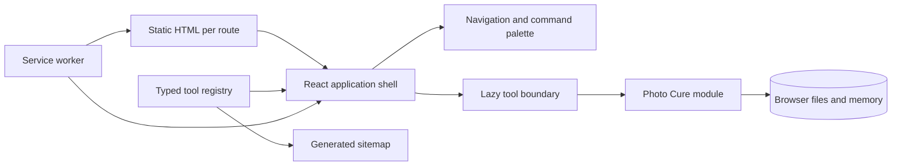

# Architecture

## System shape

`vit.tools` is a static React application deployed to Firebase Hosting. The shell is small and shared; each tool is a separately loaded browser module. There is no application server and no database.

Text fallback: static route documents load the shared shell; the registry drives discovery and lazy tool selection; tool data remains in browser memory; the service worker caches same-origin resources.

## Boundaries

- `src/app/`: platform shell only. It must not know Photo Cure internals.
- `src/registry/`: the typed catalog and route lookup.
- `src/tools/<id>/`: a complete tool module and its tests.
- `src/i18n/`: shared English/Vietnamese shell copy.
- `public/`: same-origin PWA and discovery assets.
- `vite.config.ts`: build-time generation of static tool route documents and the sitemap.

## Runtime data flow

1. Firebase serves `/` or a clean per-tool HTML route.
2. The shell resolves `window.location.pathname` against the registry.
3. React loads only the selected tool chunk.
4. The tool reads local files through browser APIs and creates temporary object URLs.
5. Preferences such as locale, favorites, and recents use `localStorage`.
6. No user file or decision is sent to a server.

## Architecture invariants

- Registry paths and ids are unique and stable.
- Tool implementations are lazy chunks.
- File contents never enter shell state.
- No analytics, remote fonts, ad scripts, or upload endpoints.
- Same-origin CSP is enforced by Firebase.
- Heavy transforms use workers; small UI coordination remains on the main thread.
- Every public tool has route metadata in both English and Vietnamese.

## Static generation

Vite builds the root document and the build plugin in `vite.config.ts` derives both `sitemap.xml` and a metadata-rich `dist/tools/<id>/index.html` document for every catalog entry. Source code remains under `src/`; generated route documents exist only in `dist/`.
